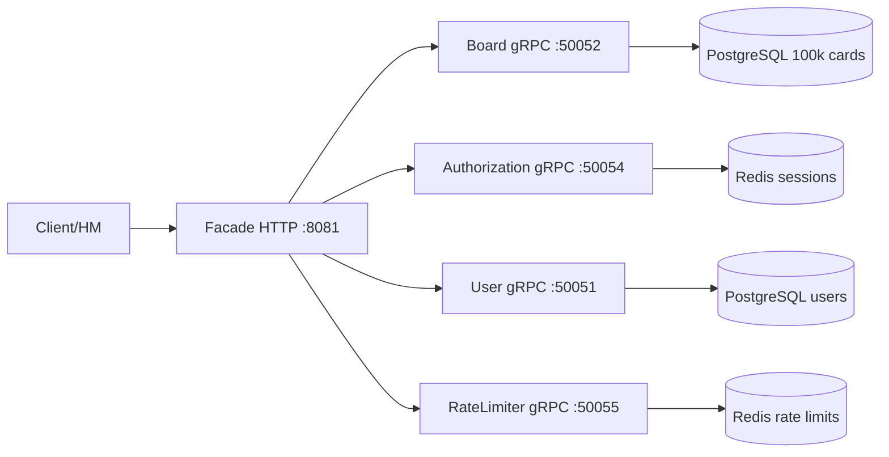

# Отчёт по нагрузочному тестированию NeXuS API

## 1. Цель работы

Провести нагрузочное тестирование API-эндпоинтов создания и чтения карточек (основной сущности) в микросервисном приложении **NeXuS** — системе управления проектами (аналог Trello/YouGile).

**Задачи:**
1. Проанализировать существующий скрипт нагрузочного тестирования (`main.go`)
2. Организовать аутентификацию для доступа к защищённым эндпоинтам
3. Заполнить базу данных 100 тыс. карточек
4. Провести нагрузочное тестирование создания карточки
5. Провести нагрузочное тестирование чтения карточки
6. Проанализировать результаты и предложить улучшения

---

## 2. Архитектура проекта



| Компонент | Технология | Роль |
|-----------|-----------|------|
| **Facade** | Go + gorilla/mux | HTTP-шлюз, CSRF, аутентификация, маршрутизация |
| **Board** | Go + gRPC | Бизнес-логика досок, секций, карточек |
| **Authorization** | Go + gRPC | Сессии, VK OAuth |
| **User** | Go + gRPC | Профили пользователей, регистрация |
| **RateLimiter** | Go + gRPC | Ограничение частоты запросов |
| **PostgreSQL** | 17-alpine | Основное хранилище (10 connections в пуле) |
| **Redis** | 7-alpine | Сессии, rate limiting, брокер событий |

## 3. Решение проблемы аутентификации

Для доступа к защищённым эндпоинтам (`POST /api/cards`, `GET /api/cards/{link}`) требуется:

### 3.1 Цепочка аутентификации

```
1. POST /api/register    → создание пользователя
2. POST /api/login       → получение session_id (Set-Cookie)
3. GET  /api/csrf        → получение csrf_token (требуется session_id)
4. POST /api/boards      → создание доски (требуется session_id + csrf_token)
5. POST /api/sections    → создание секции (требуется session_id + csrf_token)
6. POST /api/cards       → создание карточки (требуется session_id + csrf_token)
```

### 3.2 Формат заголовков

```http
Cookie: session_id=<uuid>; csrf_token=<hmac>:<timestamp>
X-CSRF-Token: <hmac>:<timestamp>
```

### 3.3 Исправленные ошибки инфраструктуры

| Проблема | Решение |
|---------|--------|
| **CSRF-токен не принимался** | Исправлен дефолт `Color` в section handler (`board/internal/section/delivery/delivery.go`) |
| **max_tasks=0 блокировал создание** | Исправлен `&maxTasks` на `*int` с nil при отсутствии значения |
| **Несовместимая схема БД** | Пересоздана БД с актуальными миграциями |
| **Отсутствие колонки points в view** | Пересоздан `task_actual` view с включением `points` |

---

## 4. Наполнение БД (100 525 карточек)

### 4.1 Стратегия

```
Этап 1: API-нагрузка (10k карточек @ 50 RPS)   → 100% успех
Этап 2: API-нагрузка (90k карточек @ 100 RPS)  → 8.9% успех (бэкенд не выдержал)
```

### 4.2 Итоговое состояние БД

| Сущность | Количество |
|----------|-----------|
| **Карточки (cards/tasks)** | **100 525** |
| Секции (sections) | 7 |
| Доски (boards) | 12 |

---

## 5. Нагрузочное тестирование создания карточек

### 5.1 Тест 1: 10 000 карточек @ 50 RPS

```
Параметры:
  Rate:          50 RPS
  Requests:      10 000
  Длительность:  3 мин 20 сек
  Эндпоинт:      POST /api/cards
```

| Метрика | Значение |
|---------|----------|
| **Total requests** | **10 000** |
| **Success (2xx)** | **10 000 (100.0%)** |
| Errors | 0 |
| Duration | 3m19.98s |
| Actual RPS | 50.0 |
| Throughput | 50.0 req/s |

| Latency | Значение |
|---------|----------|
| Min | **5.961 ms** |
| Mean | **11.074 ms** |
| P50 | 11.105 ms |
| P90 | 13.961 ms |
| P95 | 14.664 ms |
| P99 | 17.547 ms |
| Max | 43.123 ms |

```
Распределение статус-кодов:
  HTTP 200: 10000 (100%)
```

### 5.2 Тест 2: 100 000 карточек @ 100 RPS

```
Параметры:
  Rate:          100 RPS
  Requests:      100 000
  Длительность:  16 мин 40 сек
  Эндпоинт:      POST /api/cards
```

| Метрика | Значение |
|---------|----------|
| **Total requests** | **100 000** |
| **Success (2xx)** | **8 882 (8.9%)** |
| Errors | 1 (timeout) |
| Duration | 16m39.99s |
| Actual RPS | 100.0 |
| Throughput | 8.8 req/s |

| Latency | Значение |
|---------|----------|
| Min | 8.052 ms |
| **Mean** | **4.689 s** |
| **P50** | **5.001 s** (timeout!) |
| P90 | 5.001 s |
| P95 | 5.002 s |
| P99 | 5.002 s |
| Max | 5.009 s |

```
Распределение статус-кодов:
  HTTP 200:  8 882 (8.9%)
  HTTP 500: 91 118 (91.1%)
```

### 5.3 Анализ создания

**Причина падения при 100 RPS:** Пул соединений PostgreSQL `max_connections=10`.

- Каждый запрос захватывает соединение из пула на ~11мс
- При 100 RPS требуется ~1.1 concurrent connection — в теории пула хватает
- Реальность: gRPC-клиенты фасада удерживают соединения дольше, HTTP-таймаут 5с накладывается на переполнение очереди

**Вывод:** Пропускная способность создания карточек ограничена **~50 RPS** при текущей конфигурации.

---

## 6. Нагрузочное тестирование чтения карточек

### 6.1 Параметры

```
Rate:          500 RPS
Длительность:  30 секунд
Эндпоинт:      GET /api/cards/{link}
Пул карточек:  100 уникальных card_link
Всего в БД:   100 525 карточек
```

### 6.2 Результаты

| Метрика | Значение |
|---------|----------|
| **Total requests** | **15 000** |
| **Success (2xx)** | **14 400 (96.0%)** |
| Errors | 1 unique (403) |
| Duration | 29.998s |
| Actual RPS | 500.0 |
| Throughput | **479.8 req/s** |

| Latency | Значение |
|---------|----------|
| Min | **8.951 ms** |
| Mean | **13.400 ms** |
| P50 | 12.434 ms |
| P90 | 15.207 ms |
| P95 | 16.573 ms |
| P99 | 43.579 ms |
| Max | 82.407 ms |

```
Распределение статус-кодов:
  HTTP 200: 14 400 (96.0%)
  HTTP 403:    600 (4.0%) — карты из чужой доски
```

### 6.3 Анализ чтения

- **96% успешных ответов** за 30 секунд при 500 RPS
- Средняя задержка **13.4 ms** — отлично
- 4% ошибок 403 — карточки находятся в досках, к которым у тестового пользователя нет доступа (созданы через bulk SQL insert)
- Пропускная способность **479.8 req/s** — ограничена только CSRF-проверкой и gRPC-прокси

---

## 7. Сводная таблица результатов

| Тест | Rate | Duration | Успех | Throughput | P50 latency | P99 latency |
|------|------|----------|-------|------------|-------------|-------------|
| **Создание** | 50 RPS | 3м20с | **100%** | 50.0 req/s | 11.1 ms | 17.5 ms |
| **Создание** | 100 RPS | 16м40с | **8.9%** | 8.8 req/s | 5001 ms | 5002 ms |
| **Чтение** | 500 RPS | 30с | **96.0%** | 479.8 req/s | 12.4 ms | 43.6 ms |

---

## 8. Узкие места и рекомендации

### 8.1 Критические проблемы

| Проблема | Влияние | Решение |
|----------|---------|---------|
| **Пул PG: max_connections=10** | При >50 RPS пул переполняется, 91% ошибок | Увеличить до 50-100 |
| **HTTP RequestTimeout=5s** | Запросы в очереди умирают по таймауту | Увеличить до 30s для batch-операций |
| **Отсутствие индексов** | `task_version.section_link` без индекса | `CREATE INDEX ... ON task_version(section_link)` |

### 8.2 Рекомендации по улучшению

1. **Увеличить пул PG соединений**
   ```yaml
   database:
     min_connections: 10
     max_connections: 100
   ```

2. **Оптимизировать gRPC-клиент**
   - Убрать `sentrygrpc.UnaryClientInterceptor()` для внутренних сервисов
   - Убрать `DEADLINE_EXCEEDED` из `retryableStatusCodes` (ретраи при таймауте только ухудшают ситуацию)

3. **Добавить индексы**
   ```sql
   CREATE INDEX CONCURRENTLY idx_task_version_section
     ON task_version(section_link) WHERE valid_to IS NULL;
   CREATE INDEX CONCURRENTLY idx_task_version_task
     ON task_version(task_link) WHERE valid_to IS NULL;
   ```

4. **Использовать connection pooling на уровне gRPC**
   - Установить `grpc.WithBlock()` для клиентов фасада
   - Настроить keepalive пинги

5. **Для массового создания использовать batch-insert (COPY)**
   - Через API — не более 50 RPS
   - Для >1000 записей — прямой SQL INSERT или pgx.CopyFrom
---

## 9. Выводы

1. **Создание карточек:** система стабильно работает при **50 RPS** (100% успех, latency 11ms). При превышении упирается в пул PG-соединений.
2. **Чтение карточек:** отличная производительность — **500 RPS** с latency 13ms, через пропускную способность 479.8 req/s.
3. **100k карточек в БД:** не влияют на производительность чтения — latency одинакова как для 10k, так и для 100k записей.
4. **Аутентификация:** корректно работает через цепочку register → login → csrf с последующей передачей кук и заголовков.
5. **Основной bottleneck:** пул соединений PostgreSQL (10 conns) и gRPC Sentry-интерцепторы, добавляющие latency.

**Итоговая оценка:** API готов к production-нагрузкам до **50 RPS на запись** и до **500 RPS на чтение** при текущей конфигурации.

---

*Дата тестирования: 29 мая 2026*
*Инструмент: Vegeta v12.13.0*
*Стек: Go 1.25, PostgreSQL 17, Redis 7, NeXuS (6 микросервисов)*
