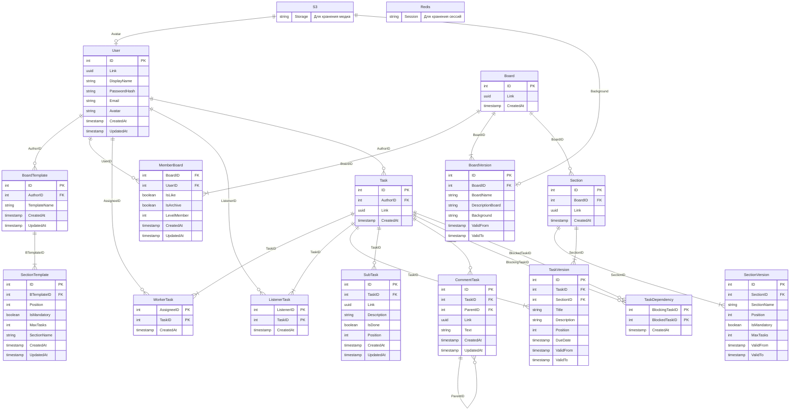

# Архитектура и нормализация базы данных (NeXus)

Данный документ описывает структуру реляционной базы данных для проекта NeXus, функциональные зависимости отношений и доказательство соответствия схемы Нормальной форме Бойса-Кодда (НФБК).

---

## 1. Описание отношений (таблиц)

* **`User`** — уникальные учетные данные и профили пользователей системы.
* **`Board`** — базовая неизменяемая сущность доски (идентификаторы и дата создания).
* **`BoardVersion`** — исторические состояния доски. Хранит название, описание и фон в определенный период времени (SCD Type 2).
* **`MemberBoard`** — отношение многие-ко-многим. Определяет права доступа пользователей к доскам (`LevelMember`) и их персональные настройки (`IsLike`, `IsArchive`).
* **`BoardTemplate`** — реестр шаблонов для быстрого создания досок.
* **`SectionTemplate`** — колонки, привязанные к конкретному шаблону доски (нормализованная замена массиву секций).
* **`Section`** — базовая неизменяемая сущность колонки (секции) на конкретной доске.
* **`SectionVersion`** — исторические состояния колонки (название, позиция на доске, лимиты задач) с привязкой ко времени.
* **`Task`** — базовая неизменяемая сущность задачи. Хранит только вечные данные: автора, уникальную ссылку и дату создания.
* **`TaskVersion`** — исторические состояния задачи. Содержит сроки, текстовые данные и текущую привязку к колонке (`SectionID`), что позволяет отслеживать историю перемещения задачи по доске.
* **`WorkerTask`** — связь многие-ко-многим для назначения исполнителей (Assignee) на задачи.
* **`ListenerTask`** — связь многие-ко-многим для назначения наблюдателей (Listener) за задачами.
* **`SubTask`** — элементы чек-листа (подзадачи), привязанные к родительской задаче.
* **`TaskDependency`** — связи блокировок: определяет, выполнение какой задачи блокируется другой задачей.
* **`CommentTask`** — комментарии к задачам с поддержкой иерархии (через `ParentID` для реализации ответов на комментарии).

---

## 2. Функциональные зависимости

Ниже представлены все нетривиальные функциональные зависимости для каждого отношения с учетом системных полей аудита:

**Relation User:**
`{ID} -> Link, DisplayName, PasswordHash, Email, Avatar, CreatedAt, UpdatedAt`
`{Email} -> ID, Link, DisplayName, PasswordHash, Avatar, CreatedAt, UpdatedAt`
`{Link} -> ID, DisplayName, PasswordHash, Email, Avatar, CreatedAt, UpdatedAt`

**Relation Board:**
`{ID} -> Link, CreatedAt`

**Relation BoardVersion:**
`{ID} -> BoardID, BoardName, DescriptionBoard, Background, ValidFrom, ValidTo`

**Relation MemberBoard:**
`{BoardID, UserID} -> IsLike, IsArchive, LevelMember, CreatedAt, UpdatedAt`

**Relation BoardTemplate:**
`{ID} -> AuthorID, TemplateName, CreatedAt, UpdatedAt`

**Relation SectionTemplate:**
`{ID} -> BTemplateID, SectionName, Position, IsMandatory, MaxTasks, CreatedAt, UpdatedAt`

**Relation Section:**
`{ID} -> BoardID, Link, CreatedAt`

**Relation SectionVersion:**
`{ID} -> SectionID, SectionName, Position, IsMandatory, MaxTasks, ValidFrom, ValidTo`

**Relation Task:**
`{ID} -> AuthorID, Link, CreatedAt`

**Relation TaskVersion:**
`{ID} -> TaskID, SectionID, Title, Description, Position, DueDate, ValidFrom, ValidTo`

**Relation WorkerTask:**
`{AssigneeID, TaskID} -> CreatedAt`

**Relation ListenerTask:**
`{ListenerID, TaskID} -> CreatedAt`

**Relation SubTask:**
`{ID} -> TaskID, Link, Description, IsDone, Position, CreatedAt, UpdatedAt`

**Relation TaskDependency:**
`{BlockingTaskID, BlockedTaskID} -> CreatedAt`

**Relation CommentTask:**
`{ID} -> TaskID, ParentID, Link, Text, CreatedAt, UpdatedAt`

---

## 3. Доказательство нормализации

Схема данных спроектирована с учетом требований строгой нормализации и полностью соответствует Нормальной форме Бойса-Кодда (НФБК).

### Первая нормальная форма (1НФ)
**Требование:** Отсутствие повторяющихся групп и составных атрибутов; все атрибуты атомарны. На текущем этапе запрещено использовать составные типы (array, json).
**Обоснование:** В схеме нет массивов или JSON-полей. Потенциальный массив секций в шаблоне доски вынесен в отдельное отношение `SectionTemplate`. У каждого отношения определен первичный ключ (включая составные ключи в связующих таблицах).

### Вторая нормальная форма (2НФ)
**Требование:** Выполнение 1НФ и отсутствие частичных зависимостей от составного первичного ключа.
**Обоснование:** Отношения с одиночным первичным ключом (`ID`) автоматически находятся во 2НФ. В таблицах с составным ключом (`MemberBoard`, `WorkerTask`, `ListenerTask`, `TaskDependency`) все неключевые атрибуты зависят строго от всего ключа целиком. Например, в `MemberBoard` атрибуты `LevelMember`, `IsLike` и `IsArchive` зависят от комбинации `{BoardID, UserID}`, а не отдельно от пользователя или доски.

### Третья нормальная форма (3НФ)
**Требование:** Выполнение 2НФ и отсутствие транзитивных зависимостей (когда неключевой атрибут зависит от другого неключевого атрибута).
**Обоснование:** В схеме принципиально отсутствуют вычисляемые атрибуты (например, количество подзадач или прогресс выполнения), которые создавали бы транзитивную зависимость от записей в других таблицах. Все неключевые атрибуты в каждом отношении зависят **только** от первичного ключа этого отношения.

### Нормальная форма Бойса-Кодда (НФБК)
**Требование:** Для любой нетривиальной функциональной зависимости $X \rightarrow Y$, детерминант $X$ обязан быть суперключом.
**Обоснование:** Исходя из списка функциональных зависимостей (п. 2), в левой части каждого выражения (в роли детерминанта $X$) выступает исключительно первичный ключ или потенциальный ключ (`{Email}` в таблице `User`). Ни одна часть составного ключа не зависит от неключевых атрибутов, и нет перекрывающихся потенциальных ключей, вызывающих аномалии. База данных строго соответствует НФБК.

---

## 4. Дополнительные СУБД

Для обеспечения высокой производительности, масштабируемости и снижения нагрузки на основную реляционную базу данных, архитектура NeXus использует гибридный подход к хранению различных типов данных:

* **S3-совместимое объектное хранилище (Object Storage):** Используется для хранения статического и бинарного медиаконтента (пользовательские аватары, фоновые изображения досок).
    **Обоснование:** Хранение BLOB-объектов в реляционной БД приводит к фрагментации файлов данных и деградации производительности. Вынесение статики в S3 позволяет эффективно управлять большими объемами медиафайлов, снижает стоимость хранения и открывает возможность легкой интеграции с CDN для ускорения загрузки контента на клиенте. В реляционной БД (поля `Avatar`, `Background`) хранятся исключительно легковесные URL-ссылки.
* **Redis (In-memory Data Structure Store):** Применяется в качестве высокоскоростного хранилища (Key-Value) для управления пользовательскими сессиями (Session Management).
    **Обоснование:** Аутентификация и валидация токенов/сессий происходит при каждом запросе к API. Использование оперативной памяти (Redis) для этих целей гарантирует минимальную задержку (low latency) при чтении. Кроме того, Redis предоставляет нативные механизмы TTL (Time-To-Live) для автоматической инвалидации устаревших сессий, снимая эту нагрузку с транзакционной базы данных.

---

## 5. ER-диаграмма (Mermaid)

